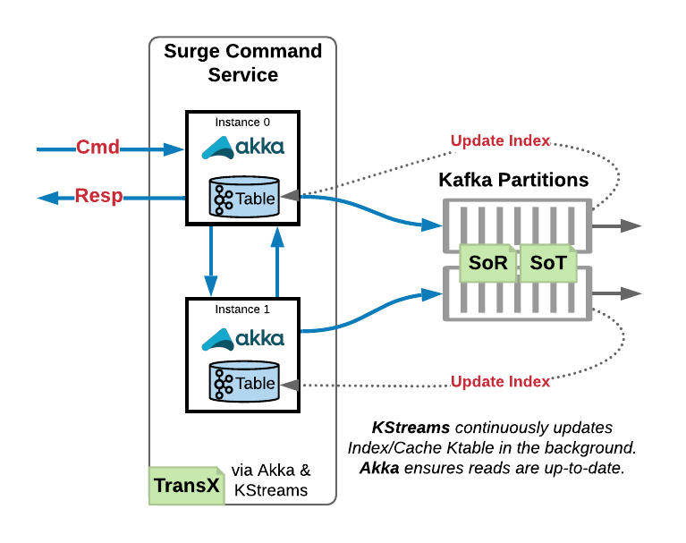
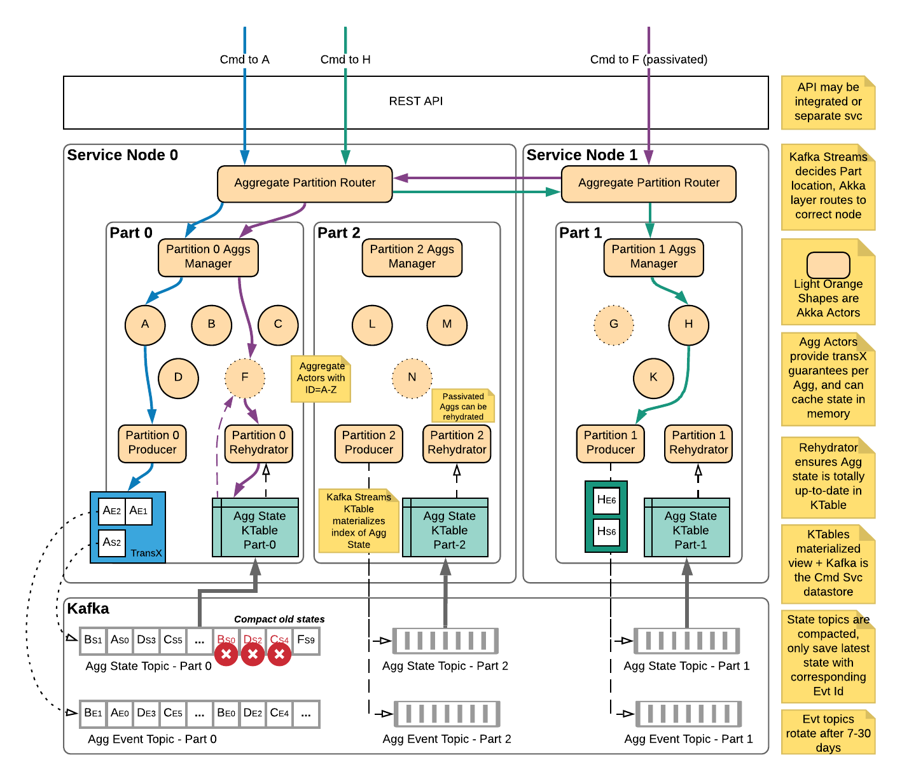

# Overview

## Command Engine

### High level overview

The Surge command engine is a library component that lives inside of a domain command application.  The engine indexes an aggregate state snapshot Kafka topic to maintain the state for each aggregate created by a domain service.
It is also responsible for managing a cluster of domain aggregates to map each unique aggregate id for a domain aggregate to a single actor within the application cluster that is responsible for that aggregate.  Because the engine maintains this state, it handles the routing of any messages to the actor instance responsible for the aggregate id the incoming message is destined for.
To determine how commands and events for an aggregate should be handled, the engine leverages an implementation of a command model interface which is provided to the engine at compile time when creating the engine.

### In depth overview

**Note** All of these in depth details are implemented in/provided by the Surge engine out of the box and do not have to be implemented in a domain app.  The details described are for anyone interested in taking a look at how things work.

#### State Tracking
When an aggregate emits new events, they are accompanied by an update to the aggregate state via a message produced to the aggregate state snapshot topic.  An aggregate id will always send state updates to the same Kafka partition - this is important for being able to compact away older aggregate snapshots and guarantee any updates to a particular aggregate id as well as provide routing (described in more detail later).
State updates sent to the state topic are consumed internally by the Surge command engine and indexed in a Kafka Streams KTable (key value store).
Since we are subscribing to Kafka to build up the state store, service nodes coordinate via a Kafka consumer group to determine which nodes are responsible for which partitions, and therefore any aggregate ids associated with that partition.

#### Message Routing
Internally, the Surge engine leverages the consumer group of the Kafka Streams process to determine which application nodes are responsible for which partitions in Kafka.
Each service node has a single router actor that follows updates to the consumer group and associates each partition with the address (maybe local, maybe remote) of a partition manager actor.
The partition manager actor for each partition keeps track of which aggregate actors are running in memory and which are not.  It performs the local routing of messages to the correct aggregate actor for the given aggregate id.
Since each aggregate only sends to a particular partition in Kafka, we can see which partition an aggregate is associated with and have the router forward to the appropriate partition manager.
Any messages for a particular aggregate id are first routed to the correct partition manager, and then to the correct actor responsible for the given aggregate id.

@@@ note

Why does Surge route message from node to node? Why not just have the node that received a command handle it?

This comes back to some of the guarantees we want to provide.  By having a single instance of an aggregate id across an entire application cluster, we can guarantee there is always only a single writer for that aggregate in order to guarantee the order eliminate race conditions between multiple nodes publishing events for the same aggregate simultaneously.

@@@

#### Guarantees Around Events & Aggregate State

The Surge engine guarantees two important things around persisted events and state:
  - All-or-nothing publishing for groups of events and updated state.  When a handled command results in some events (1 or more) they are applied to the aggregate state to get a new aggregate snapshot.  Using Kafka transactions, we guarantee that either all of those events along with the aggregate state are published to Kafka or none of them are and the transaction is cancelled.  This is important to guarantee that any state snapshots are directly derived from the event stream with no discrepancy between the two.
  - When handling a command, the most recently updated aggregate state for an aggregate will be passed to the command handler.  This guarantees that domain logic for handling a command or event will always see the most recently updated state for an aggregate, never a stale or old state.

To guarantee that any fetched aggregate state is always the most recent version for a particular aggregate id the Surge engine maintains a stateful producer actor.
The stateful producer actor is responsible for following which aggregates have state snapshots that have been published to Kafka but not yet consumed and reflected in the aggregate state KTable.

When an aggregate actor is newly created (i.e. not in memory when a command is sent to it) it must ensure that the state of the aggregate in the aggregate KTable is up to date.
It does this by checking with the stateful producer actor if there are any pending messages for the given aggregate id.
If there are, the aggregate actor buffers the command and checks again after a short delay with the producer actor.
The aggregate actor will perform this check several more times before either succeeding or giving up.
If there are no in flight messages for the aggregate, the aggregate state KTable is up to date for the given aggregate id, so the actor may initialize from the state KTable and process the command as normal.

#### Use of Kafka Transactions

Surge uses Kafka transactions under the hood to ensure the events topic and aggregate state are in sync, guarantee batches of events are written in an all-or-none way,
and preserve the integrity of the event stream by fencing out "zombie producers". [This blog post](https://www.confluent.io/blog/transactions-apache-kafka/)
by Confluent is a great resource to learn about transactions in general.

Surge uses a stateful Kafka producer per partition to remember what aggregates have recently published data and follow along indexing of the aggregate state topic.
Transactional ids are assigned uniquely for each partition of the aggregate state topic by using the name and partition number for the aggregate state topic that the
stateful producer is following as a suffix to the transactional id prefix: for example `my.transaction.id.prefix-my.state.topic-0`.  Since the routing for Surge ensures
there should only be a single shard responsible for each of these partitions, no two producers should share a transactional id.  If two were using the same id, the older of the
producers is considered a "zombie producer" and is prevented from writing data by Kafka and shut down in order to preserve the integrity of the event stream.
