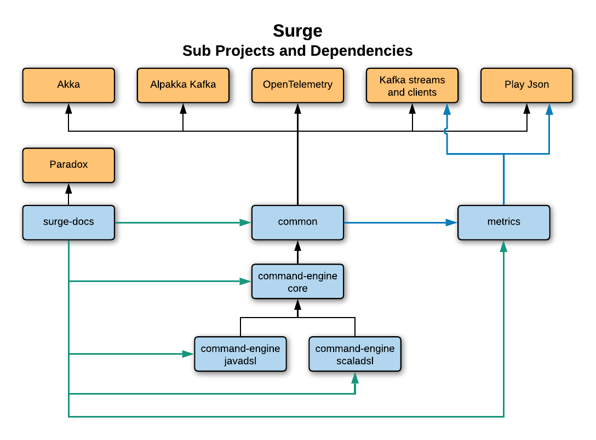

# Repository Tour

*Note - this page is a work in progress*

## Project Overview

The Surge Project Repo is broken down into multiple subprojects described below.

### Surge Subprojects and Dependencies

## Subprojects

### Common

* Base traits
* Serializers and Deserializers
* Kafka Consumer Group based Clustering for Akka
* Akka Streams over Kafka Streams
    * Data Sinks, Sources and Pipelines
* Kafka Aggregate State Stores
* Exceptions
* Observability
  * Health Monitoring
  * Metrics
  * OpenTracing  

### Command Engine Core

* Command Model Traits
* Akka based Command Processing Engine
* Exceptions

### Command Engine Scala DSL

* User Code facing Scala API's

### Command Engine Java DSL

* User Code facing Java API's
* Provides for conversion of monad types (Option, Collections, Future)

### Metrics

* Provides Metrics Model used to instrument other Surge components
* Provides a simple interface to retrieve messages for submission to monitoring platforms

### Docs

* These Docs
* Doc Site generated using Paradox
* Docs use tested examples as example snippets

## Dependencies

### Akka
[Akka Docs](https://akka.io/docs/)

### Alpakka Kafka
[Alpakka Docs](https://doc.akka.io/docs/alpakka/current/index.html)

### Kafka Streams and Clients
[Kafka Docs](https://kafka.apache.org/documentation/)

### Play Json
[Play Json Docs](https://www.playframework.com/documentation/2.8.x/ScalaJson)

### OpenTelemetry
[OpenTelemetry Docs](https://opentelemetry.io/docs/)

### Paradox Plugin
[Paradox Docs](https://developer.lightbend.com/docs/paradox/current/index.html)
