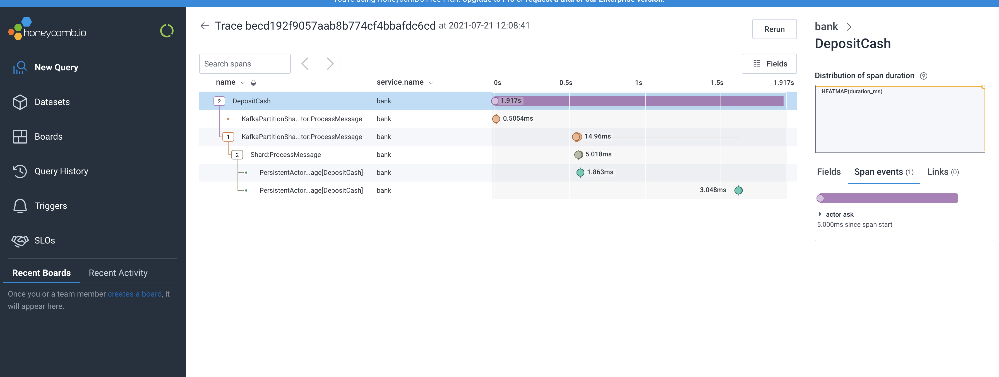
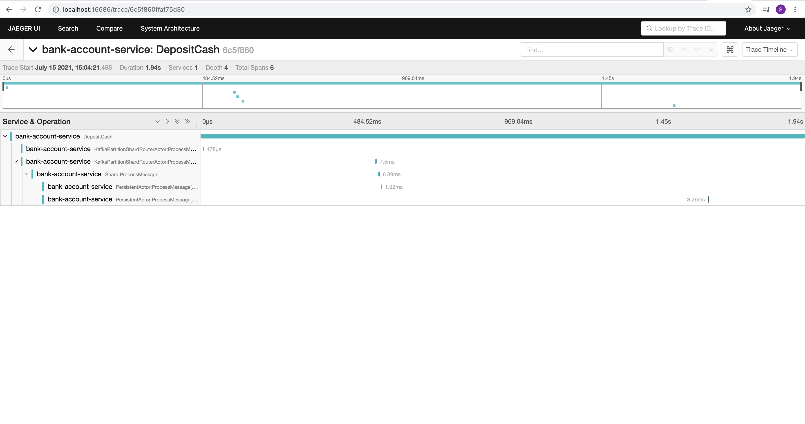

# Open Telemetry Integration

Surge integrates with Open Telemetry compatible platforms such as Jaeger, Zipkin, Honeycomb etc. 

## Example Configuration

You can provide an OpenTelemetry instance by overriding `openTelemetry` in your Surge model. 

### Using Honeycomb

@@dependency[sbt,Maven,Gradle] {
group="io.opentelemetry" artifact="opentelemetry-sdk" version="1.4.1"
group2="io.opentelemetry" artifact2="opentelemetry-exporter-otlp" version2="1.4.1"
group3="io.grpc" artifact3="grpc-netty-shaded" version3="1.39.0"
}

Scala
:    @@snip [SurgeModel.scala](/modules/surge-docs/src/test/scala/docs/command/BankAccountSurgeModelWithHoneycomb.scala) { #surge_model_class }

Java
:    Java examples coming soon..

#### Screenshot

### Using Jaeger 

@@dependency[sbt,Maven,Gradle] {
group="io.opentelemetry" artifact="opentelemetry-sdk" version="1.4.1"
group2="io.opentelemetry" artifact2="opentelemetry-exporter-jaeger" version2="1.4.1"
group3="io.grpc" artifact3="grpc-netty-shaded" version3="1.39.0"
}

Scala
:    @@snip [SurgeModel.scala](/modules/surge-docs/src/test/scala/docs/command/BankAccountSurgeModelWithJaeger.scala) { #surge_model_class }

Java
:    Java examples coming soon..

#### Screenshot

